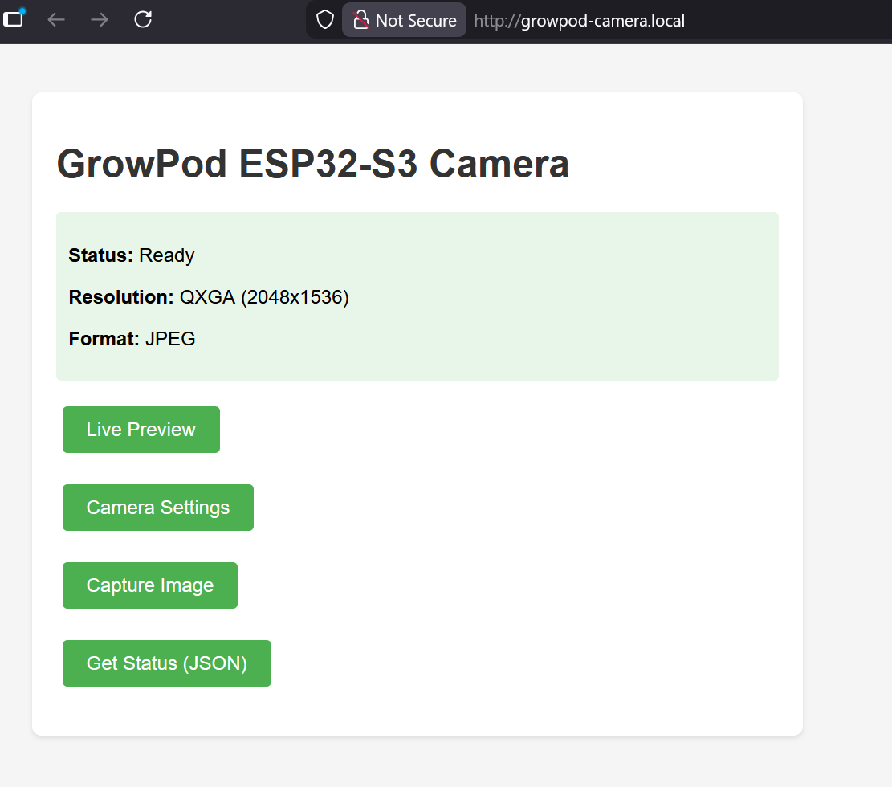
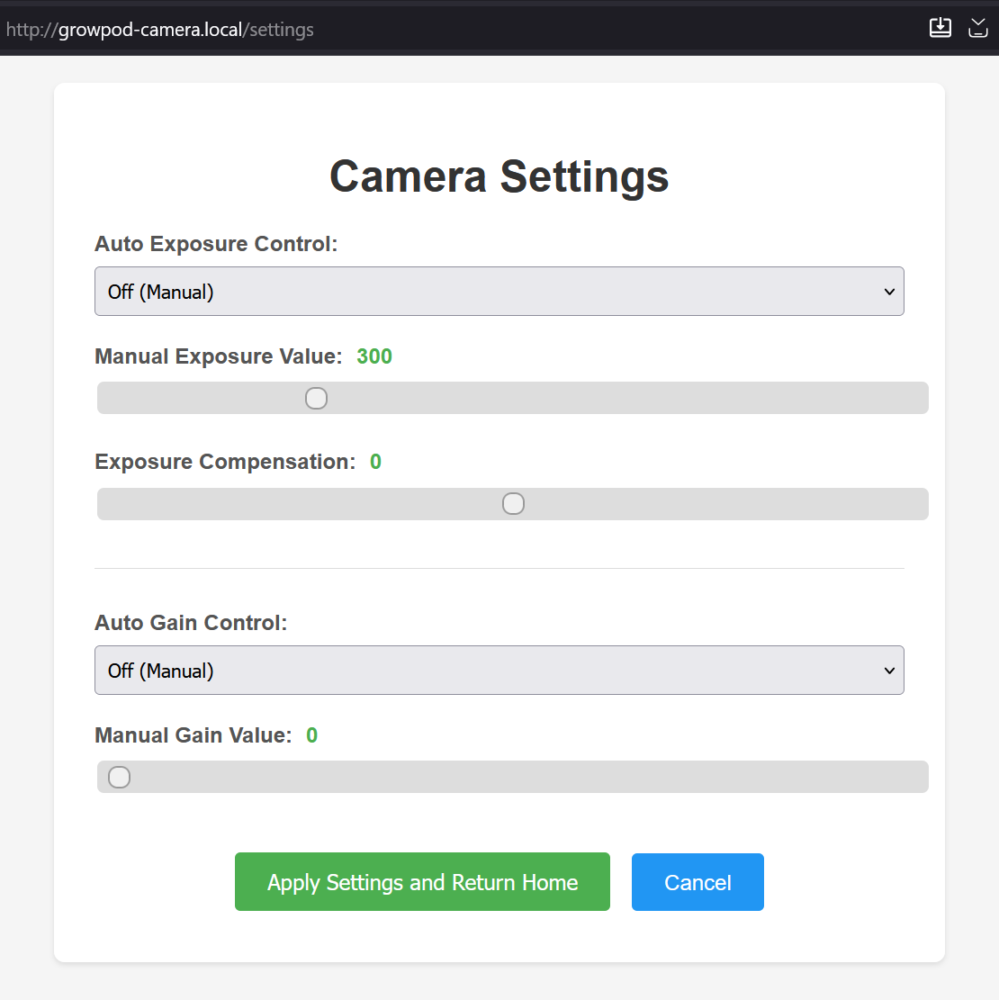
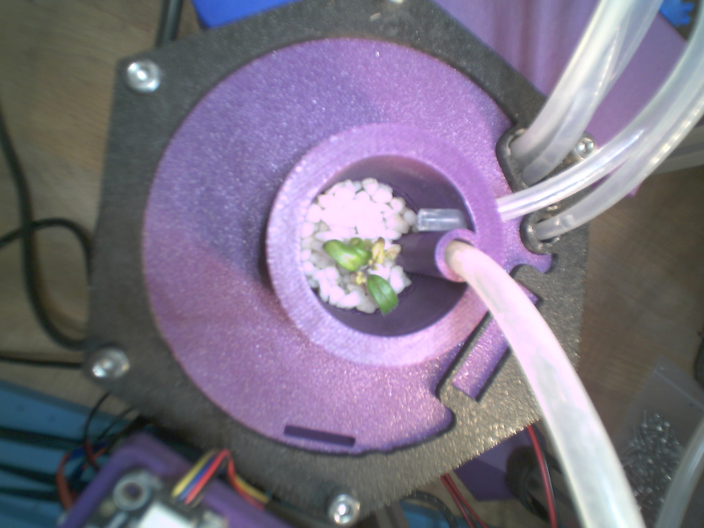

# GrowPod ESP32-S3 Camera

WiFi-enabled camera system for the Seeed Studio XIAO ESP32S3 Sense board with OV3660 camera module. Captures high-resolution QXGA (2048x1536) JPEG images accessible via HTTP/mDNS.

## Demo

### Web Interface

<p align="center">
  
  <br>
  <em>Home page with quick access to preview, settings, and capture</em>
</p>

<p align="center">
  
  <br>
  <em>Camera settings page with exposure and gain controls</em>
</p>

### Sample Captures

<p align="center">
  
  <br>
  <em>Example QXGA (2048x1536) capture of a plant in a GrowPod - Full resolution, JPEG quality 4</em>
</p>

## Features

- **High Resolution**: QXGA (2048x1536) JPEG capture
- **Live Preview**: VGA (640x480) MJPEG stream for camera framing
- **Camera Settings**: Web-based exposure, gain, and quality controls
- **WiFi Connectivity**: HTTP web server for remote image access
- **mDNS Support**: Access via `http://growpod-camera.local/`
- **Optimized Performance**: ~1.5 second capture-to-transfer time
- **8MB PSRAM**: Octal PSRAM (OPI) mode for high-speed image buffering

## Hardware Requirements

- **Board**: Seeed Studio XIAO ESP32S3 Sense
- **Camera**: OV3660 (built-in to XIAO ESP32S3 Sense)
- **PSRAM**: 8MB Octal PSRAM (built-in)
- **WiFi**: 2.4GHz 802.11b/g/n

## Software Requirements

- ESP-IDF v5.4.2 or later
- Python 3.x with `requests` library (for client script)

## Project Structure

```
growpod-esp-camera/
├── CMakeLists.txt                 # Root project configuration
├── sdkconfig                      # ESP-IDF configuration
├── sdkconfig.defaults             # Default configuration (PSRAM, mDNS)
├── README.md                      # This file
├── capture_wifi.py                # Python client for image capture
├── main/
│   ├── CMakeLists.txt             # Main component configuration
│   ├── idf_component.yml          # Managed component dependencies
│   ├── main.c                     # Application entry point
│   ├── secrets.h                  # WiFi credentials (gitignored)
│   ├── secrets.h.template         # Template for WiFi credentials
│   ├── camera/
│   │   ├── camera.h               # Camera module interface
│   │   └── camera.c               # Camera initialization & capture
│   ├── wifi/
│   │   ├── wifi.h                 # WiFi/mDNS module interface
│   │   └── wifi.c                 # WiFi connection & mDNS setup
│   └── web_server/
│       ├── web_server.h           # HTTP server interface
│       └── web_server.c           # HTTP handlers (/capture, /status, etc.)
└── build/                         # Build output directory
```

## Getting Started

### 1. Clone and Configure

```bash
cd ~/Code
git clone <repository-url> growpod-esp-camera
cd growpod-esp-camera
```

### 2. Set WiFi Credentials

Copy the template and edit with your WiFi credentials:

```bash
cp main/secrets.h.template main/secrets.h
# Edit main/secrets.h with your WIFI_SSID and WIFI_PASSWORD
```

### 3. Build and Flash

Using ESP-IDF extension in VS Code:
- Press `F1` and select "ESP-IDF: Build your project"
- Connect XIAO ESP32S3 Sense via USB
- Press `F1` and select "ESP-IDF: Flash your project"
- Press `F1` and select "ESP-IDF: Monitor your project"

Or using command line:
```bash
idf.py build
idf.py -p COM5 flash monitor
```

### 4. Access the Camera

Once connected to WiFi, access the camera at:
- **mDNS**: `http://growpod-camera.local/`
- **Direct IP**: Check serial monitor for assigned IP address

## HTTP API Endpoints

### Web Pages

#### `GET /`
Home page with navigation to preview, settings, capture, and status.

#### `GET /preview`
Live preview page with MJPEG video stream (VGA 640x480) and high-res capture button.

#### `GET /settings`
Camera settings page with exposure, gain, and quality controls.

### API Endpoints

#### `GET /stream`
MJPEG video stream at VGA resolution (640x480).
- **Content-Type**: `multipart/x-mixed-replace`
- **Query Parameter**: `quality` (6-12, default 10)
- **Frame Rate**: ~10 FPS
- **Usage**: `http://growpod-camera.local/stream?quality=10`

#### `GET /capture`
Captures and returns a high-resolution JPEG image (2048x1536).
- **Content-Type**: `image/jpeg`
- **Size**: ~350KB per image
- **Time**: ~1.5 seconds

#### `GET /control`
Apply camera settings.
- **Query Parameters**:
  - `aec` (0=manual, 1=auto exposure)
  - `aec_value` (0-1200, manual exposure value)
  - `ae_level` (-2 to +2, exposure compensation)
  - `gain_ctrl` (0=manual, 1=auto gain)
  - `agc_gain` (0-30, manual gain value)
- **Usage**: `http://growpod-camera.local/control?aec=1&ae_level=0&gain_ctrl=1`

#### `GET /get_settings`
Returns current camera settings as JSON:
```json
{
  "aec": 1,
  "aec_value": 300,
  "ae_level": 0,
  "gain_ctrl": 1,
  "agc_gain": 0
}
```

#### `GET /status`
Returns JSON system status:
```json
{
  "status": "ready",
  "camera": "OV3660",
  "resolution": "QXGA",
  "width": 2048,
  "height": 1536,
  "format": "JPEG",
  "psram": true
}
```

#### `GET /favicon.ico`
Returns 204 No Content (prevents browser warnings).

## Python Client

Use the included Python script to capture images:

```bash
# Install dependencies
pip install requests

# For fast mDNS resolution (highly recommended on Windows)
pip install zeroconf

# Interactive mode (press ENTER to capture repeatedly)
python capture_wifi.py growpod-camera.local

# Single capture with specific filename
python capture_wifi.py growpod-camera.local my_photo.jpg

# Or use IP address (fastest, no DNS resolution)
python capture_wifi.py 192.168.1.100
```

**Note**: The `zeroconf` library enables fast mDNS hostname resolution (instant vs 10-15 seconds on Windows). Without it, the script falls back to standard DNS resolution which is very slow for `.local` hostnames on Windows.

## Configuration Notes

### PSRAM Configuration (Important!)
The XIAO ESP32S3 Sense uses **Octal PSRAM** (OPI mode), not Quad. This is configured in `sdkconfig.defaults`:
```
CONFIG_SPIRAM_MODE_OCT=y
```

### mDNS Hostname
Default hostname: `growpod-camera`
To change, edit `main/wifi/wifi.c` and modify:
```c
#define MDNS_HOSTNAME "your-hostname-here"
```

### Camera Settings
JPEG quality and resolution are configured in `main/camera/camera.c`:
```c
.frame_size = FRAMESIZE_QXGA,   // 2048x1536
.jpeg_quality = 4,               // Lower = better quality (0-63)
```

## Performance

### Optimized Configuration

This project is configured for **maximum WiFi throughput** with optimizations including:
- **WiFi Power Saving Disabled**: Zero latency, instant response
- **Large TCP Buffers**: 65KB send/receive windows for bulk transfers
- **TCP NODELAY**: Nagle's algorithm disabled for immediate packet transmission
- **Increased Block Ack Windows**: 32 frames (vs default 6) for better throughput
- **Large RX/TX Buffers**: 64 dynamic buffers (vs default 32)

### Real-World Performance

Based on extensive testing with QXGA (2048x1536) captures over WiFi:

**Image Capture (Camera Sensor):**
- Range: 105-175ms
- Average: ~130ms
- Consistent and predictable

**WiFi Transfer (ESP32 → Client):**
- Best case: 150-300ms (excellent conditions)
- Typical: 1-3 seconds (normal WiFi congestion)
- Worst case: 5-6 seconds (heavy interference)
- **Highly variable** due to shared WiFi medium

**Total End-to-End Time:**
- Best case: ~300ms (1 MB/s throughput)
- Typical: ~1.5-3 seconds (100-200 KB/s)
- Worst case: ~6 seconds (50 KB/s)

**Image Size:** ~260-290KB (JPEG quality 4, varies with scene complexity)

### Performance Notes

- **WiFi is a shared medium**: Transfer times vary based on channel congestion, interference, and other network activity
- **Best performance**: Achieves ~1 MB/s (300ms for 290KB) with clean WiFi conditions
- **Power consumption**: Higher than default due to disabled power saving (performance prioritized)
- **Consistency**: Camera capture is consistent (~130ms), WiFi transfer variance is normal behavior

## Troubleshooting

### PSRAM Init Failed
Ensure `CONFIG_SPIRAM_MODE_OCT=y` is set in sdkconfig. The XIAO uses Octal PSRAM, not Quad.

### WiFi Connection Failed
1. Verify `main/secrets.h` has correct SSID and password
2. Ensure router supports 2.4GHz WiFi
3. Check serial monitor for connection errors

### mDNS Not Resolving
- **Windows**: Install [Bonjour Print Services](https://support.apple.com/kb/DL999)
  - Even with Bonjour, mDNS resolution can be slow (10-15 seconds)
  - **Recommended**: Use IP address directly for faster response
- **Linux**: Install `avahi-daemon`
- **macOS**: Built-in support (fast and reliable)
- **Fallback**: Use direct IP address from serial monitor

**Performance Tip**: On Windows, using the IP address (`192.168.x.x`) instead of the mDNS hostname (`growpod-camera.local`) provides instant connection vs 10-15 second delays.

### Build Errors
```bash
# Clean and rebuild
idf.py fullclean
idf.py build
```

## Dependencies

Managed via `main/idf_component.yml`:
- **espressif/esp32-camera**: ^2.0.0
- **espressif/mdns**: ^1.3.0

## License

This project is licensed under the **GNU General Public License v3.0 (GPL-3.0)**.

This means you are free to:
- Use this software for any purpose
- Change the software to suit your needs
- Share the software with your friends and neighbors
- Share the changes you make

Under the following terms:
- If you distribute this software or modifications of it, you must make the source code available under the same GPL-3.0 license
- You must include a copy of the GPL-3.0 license with any distribution
- You must state any significant changes made to the software

See the [LICENSE](LICENSE) file for the full license text, or visit https://www.gnu.org/licenses/gpl-3.0.en.html

## Technical Support

For issues specific to this project, please open a GitHub issue.

For ESP-IDF and hardware support:
- ESP32 Forum: https://esp32.com/
- Seeed Studio: https://forum.seeedstudio.com/

